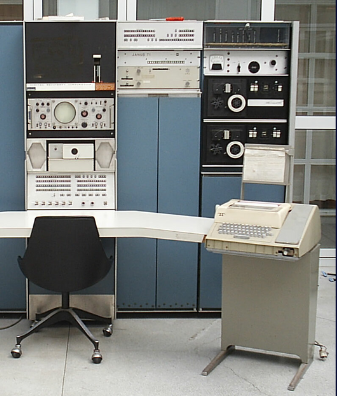

---
title: Terminal (bash)
date: 2025-1
---

# Shells

## Introducción
Una _shell_ o _intérprete_ de línea de comandos, es un programa que permite enviar comandos al sistema, normalmente, tanto de _forma interactiva_ como por _lotes_.

## Terminales
La primera forma de interactuar con una shell es mediante una _terminal_: interfaz de texto que permite introducir comandos y mostrar el resultado.

* Terminales hardware
	* Teletipos
	* VDUs
* Terminales software
	* Terminales de texto
	* Emuladores de terminal

# Terminales hardware

## Teletipo

Las terminales actuales basan su funcionamiento en la forma en la que trabajan los _teletipos_: dispositivos para enviar mensajes. 

## Teletype Model 33

* Diseñado en 1963 por Teletype Corp.
* Bajo precio: fue muy popular entre las minicomputadoras
* Fue de las primeras en usar (y popularizar ASCII.
* Solo permitía mayúsculas, lo que influyó en la sintaxis de muchos lenguajes.
* BASIC fue diseñado específicamente para escribirse en este teletipo.
* Tomlinson usó el símbolo @ para las direcciones de correo por que estaba disponible en este teletipo.

# Terminales software

## Terminal de texto

* En Unix, la terminal o consola de texto es el componente del sistema que nos permite interactuar con un shell.
* Prácticamente las terminales soportan caracteres comodín, tuberías, sintaxis HERE, substitución de comandos, variables, y estructuras de control para iteraciones y condicionales.
* Dado a que es un software, el sistema nos provee de varias terminales virtuales, accesibles desde /dev/ttyx
	* Y desde C-M-<fx> (Ctrl-Alt-<Fx>)
	
## Emulador de terminal 

En entornos gráficos, también podemos mostrar una **terminal** dentro de una ventana gráfica. El programa que permite esto es el _emulador de terminal_.

Normalmente permiten funciones adicionales, como varias pestañas, formato del texto, y secuencias ASCII que solo están disponibles en entornos gráficos.

## Emuladores más populares

* Gnome Terminal
* kitty
* Konsole
* rxvt
* Windows Console
* Windows Terminal
* xterm y term

# Tipos de shells

## Basadas en Bourne-shell

Creada en 1979 en los Bell Labs. Es la familia más popular hoy en día. Varios detalles, como el uso de $, fueron propuestos por éste.

* Alquimist shell (ash y dash)
* Bourne-again shell (bash)
* Korn shell (ksh)
* Z shell (zsh)
* Friendly-interactive shell (fish)

## Basadas en C-shell

Creada en la Universidad de Berkeley, toma su sintaxis del lenguaje C.

La shell más utilizada es tcsh.

# Bash

## Generalidades
* Bash es el emulador de terminal del proyecto GNU
* Creado por Brian Fox en 1989
* Es la shell más popular en los sistemas Linux
* Bash cumple todas las características descritas por POSIX, pero incluye muchas extensiones
* Cheatsheet de la sintaxis: [Bash scripting](https://devhints.io/bash)

 

