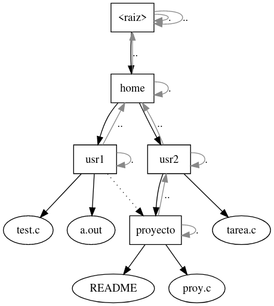
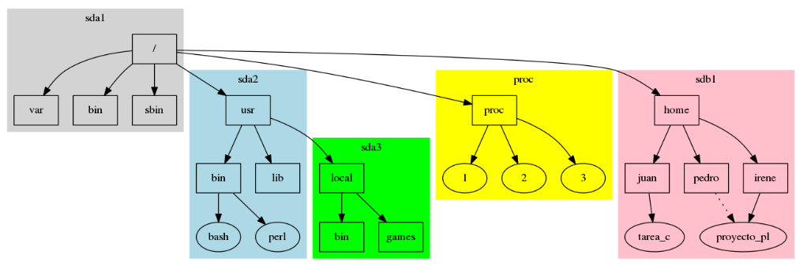

---
title: Sistemas de archivos
date: 2025-1
---

## Antecedentes

**Todo es una secuencia o 'stream' de bytes**
* Los primeros dispositivos no reconocían archivos, solo almacenaban conjuntos de datos:
	* _Analógicos_: discos de vinilo, cintas de casette.
	* En el nivel más bajo, los dispositivos _digitales_ también almacenan solamente bytes.
	

## ¿Qué es un archivo?

**Abstracción o TAD que el SO propone para un conjunto de bytes en un dispositivo.**
* El SO expone funciones al usuario para poder manipular el contenido de un archivo (o sea, los bytes asociados) sin preocuparse de cómo se guardan éstos en el dispositivo.

## Operaciones sobre archivos

* Crear (create)
* Borrar (delete)
* Abrir (open)
* Cerrar (close)
* Leer (read)
* Escribir (write, flush)
* Reposicionar (seek)

## Archivos de texto y binarios

**Los "archivos de texto" son archivos binarios que solo contienen un subconjunto de bytes, los que representan caracteres imprimibles**
* Tradicionalmente, el conjunto de caracteres imprimibles _ASCII_.
	* Ahora, con la adopción de Unicode, cualquier caracter Unicode válido que no sea un caracter de control.
	* Aunque depende del contexto.

# Formato de archivo

## Estándar o especificación
 
**Los datos dentro de un archivo pueden estar ordenados de mil formas distintas, y corresponde a quien los crea decidir el orden de los datos en un archivo.**
* El formato de un tipo de archivo específico puede estar reglamentado por un estándar o especificación.

## Formatos libres y privativos

* Existen formatos cuya especificación es libre y otros cuya especificación no lo es.
* Existen formatos documentados, documentados a medias, y no documentados.
* Generalmente, los formatos libres están bien documentados.

## ¿Cómo determinar el tipo de un archivo?

* Extensiones de archivo
	 * Implementados originalmente por CP/M
		* Y, por consiguiente, MS/DOS y Windows
* Metadatos asociados a un archivo
	* Mac OS y typecodes
* Números mágicos
	* Forma seguida por los sistemas Unix
_Hay que tener cuidado al hacer esto._

# Sistemas de archivos

## ¿Qué son?

**Los sistemas de archivos organizan archivos.**
* Algunos sistemas de archivos buscan redundancia, mayor rapidez, tolerancia a fallos o protección por cifrado.
* Permiten guardar diversos datos sobre los archivos: _"metadatos"_:
	* Nombre, permisos, fechas (de acceso, de modificación), si son de alguna categoría especial, etc.
* **Ruta de archivo:** existente para prácticamente cualquier SO.

## ¿Cuáles existen?

* FAT
	* FAT16
	* FAT32
	* exFAT
* NTFS
* ext*
	* ext2
	* ext3
	* ext4
* HFS
	* HFS+
* UFS
* ZFS
* btrfs
* cdfs
	* UDF (ISO 9600)
	
## ¿A qué se parece?

En general, la abstracción del sistema de archivos se parece a un _archivero de oficina_ en la vida real.

La nomenclatura puede variar un poco, dependiendo del enfoque y del tipo de usuario final: directorios en Unix vs carpetas en Windows.

# Sistema de archivos virtual

## ¿Qué es? 

* La idea de sistema de archivos tiene más usos, y puede ser usada para exponer datos que no necesariamente están en un _soporte_.
* Los sistemas de archivos que funcionaban sobre datos en un soporte se categorizan ahora como _'sistemas de archivos de disco'_.
	* Sistemas de archivos de red: sshfs, nfs, ftp
	* Sistemas de archivos de propósito especial: tmpfs, swap, lufs, devfs, sysfs

## Ejemplos

* Las rutas de una URL tienen forma de ruta de archivo, pero no necesariamente tienen que ser archivos, por eso siempre hablamos de _recursos_.
* **Filosofía Unix:** todo es un archivo.
* Archivos especiales: pipas, dispositivos,
* **FUSE:** crea tu propio sistema de archivos.

# Organización de archivos

## Tipos de sistemas de archivos

* En un sistema de archivos generalmente queremos guardar _muchos_ archivos.
* Existen varios tipos de sistemas de archivos, según la forma de organizar archivos:
	* Sistemas planos
		* A pesar de lo simple, aún se usan: Amazon S3
	* Sistemas con etiquetas
	* Sistemas de profundidad fija
	* Sistemas con _árbol de directorios_
	
## Árbol de directorios

* El directorio es una estructura para agrupar archivos de forma _jerárquica_.
* Cada directorio está dentro de otro directorio, excepto el directorio raíz.
* Cada archivo o directorio (inodo) tiene una _ruta_ de búsqueda que lo identifica.
* Por todo lo anterior, podemos representar al sistema de archivos como un _grafo dirigido_.
* En muchos sistemas, cada directorio contiene dos directorios especiales:
	* **.** --> apunta a sí mismo
	* **..** --> apunta al directorio padre
Excepto **/gfdg**, que apunta a si mismo

## Descriptores de archivo

# Ligaduras

## Duras
## Simbólicas
## Accesos directos

## Buffers 

# Montaje

## ¿Pueden existir dos sistemas de archivos al mismo tiempo?

* El sistema solo puede trabajar con un sistema de archivos a la vez, dado que solo hay un árbol de directorios.
* Para poder trabajar con otros sistemas de archivos, debemos **montarlos**.
	* Esto es **hacer que un sistema de archivos esté accesible desde una ubicación determinada**.
	* A esa ubicación le llamamos _punto de montaje_: un directorio dentro del sistema de archivos principal.
* Si el punto de montaje ya tenía archivos, éstos estarán ocultos.

## Archivo /etc/fstab

En el archivo /etc/fstab están listados los sistemas de archivos que el SO ya conoce, y sabe donde montar.

	

## 

* Podemos montar cualquier tipo de sistema de archivos, sin importar su estructura subyacente, siempre y cuando haya algún _controlador_ para dicho sistema.
	* Eso incluye imágenes y archivos regulares.
* Unix tiene dos utilidades para administrar montajes:
	* **mount** monta sistemas de archivos.
	* **umount** revierte esa operación.

## mount -t ext4 -o ro,loop /tmp/imagen5.img /mnt/tmp/

# Permisos unix

## Propiedad

* Todos los archivos y directorios en un sistema Unix pertenecen a un usuario y grupo en específico.
* Solo el propietario de un archivo y el usuario root pueden cambiar estos permisos.
* Esto es parte del estándar POSIX.

## chown, chgrp

Estos dos comandos nos permitirán modificar el usuario y grupo dueño de un archivo: chown y chgrp.

_comando_ [-RL | -h] _usuario|grupo objetivo_

* Parámetros específicos:
	* -R aplica recursivamente
	* -L atraviesa enlaces simbólicos a directorios
	* -h aplica la acción sobre el enlace simbólico, en vez de sobre el objeto apuntado

## Permisos

Todos los archivos y directorios en un sistema Unix tienen 3 tipos de permisos básicos, que indican qué usuarios pueden operar con ellos, y cómo:

| Permiso  | Archivos | Directorios |
|  :---:  |  :----:  |  :---:  |
| Lectura (r) | Leer el archivo   | Listar archivos dentro del directorio (ls) |
| Escritura (w)    | Escribir sobre el archivo | Modificar entradas del directorio: crear, renombrar y borrar archivos |
| Ejecución (x)    | Ejecutar el archivo | Moverte al directorio (cd), o buscar dentro del directorio |

## setuid y setgid

Existe forma de otorgar ciertos permisos _‘elevados’_ a un usuario común **cuando ejecuta un programa**.
* **Sobre ejecutables:** otorga al usuario los permisos del dueño del ejecutable (setuid), o del grupo (setgid).
* **Sobre directorios:** setuid es ignorado, setgid obliga a que todos los archivos dentro del directorio tengan el mismo grupo dueño.

## sticky

* Dos permisos diferentes, en realidad:
* **Sobre ejecutables:** hace que un ejecutable se quede residente en memoria principal.
* **Sobre directorios:** evita que un usuario modifique detalles sobre archivos que no posee.
* El uso sobre ejecutables ya no se implementa en casi ningún sistema Unix.
	* Sí en UnixWare y HP-UX
	
## chmod

El comando para modificar permisos en archivos es _chmod_.

chmod _permisos objetivo_

* Parámetros específicos:
	* -R aplica recursivamente
	* -L atraviesa enlaces simbólicos a directorios
	* chmod no cambia permisos de enlaces simbólicos, puesto que éstos nunca se ocupan en el sistema.
	
# Notación

## Notación numérica o absoluta

Consiste en un número octal de tres dígitos, un dígito por agente.

## Operaciones con chmod

Establecer permisos base con chmod es sencillo, ejemplos:
	* chmod 644 archivo.txt
Establecer los bits setuid, setgid y sticky se hace anteponiendo un dígito octal que establece los tres permisos en el orden descrito:
* chmod 1644 archivo.txt

## Notación simbólica

Consiste en una cadena de letras, donde cada letra especifica un permiso. Además, incluye otros datos.

### Tipo de inodo

xd